  

 

  
  
  

 

### What I build

I'm a **Full Stack Developer & AI Engineer** from São Paulo, Brazil. I specialize in building robust production systems, from seamless frontend interfaces to scalable backend APIs, containerized infrastructure, and automated data pipelines.

Recently, I've been heavily focused on **Self-Hosted Infrastructure** and **AI Engineering**, managing bare-metal servers and VPS environments (Hetzner, KingHost). I build systems involving RAG (Retrieval-Augmented Generation), vector databases, orchestration layers, and workflow automation.

- 🏗️ **Currently building:** Agentic AI orchestrators, core microservices for the Zenrick & Sementia ecosystem, Pixion generative media, and autonomous workflows.
- 🌱 **Learning & Exploring:** Advanced Vector Search (`pgvector`), Model Context Protocol (MCP), and High-Availability Distributed Systems.
- 🤝 **Open to:** Collaborations, open-source projects, and deep technical discussions.

---

### 🛠️ Tech Stack & Tools

**AI Engineering & Data**

  
  
  
  
  

**DevOps, Infra & Automation**

  
  
  
  
  
  
  

**Backend & Databases**

  
  
  
  
  

**Frontend Development**

  
  
  
  
  

---

### 📊 GitHub Analytics

  
  

 

  

---

### 🚀 Highlighted Systems (Zenrick · Sementia · Pixion)

*Core architecture of the private ecosystems I build and operate — agentic infra, SaaS engines, and generative media.*

| Project / Domain | Description | Core Technology |
|---------|-------------|------------|
| 🧠 **Nexus / Kyron (AI Core)** | Agentic AI orchestrator featuring Model Context Protocol (MCP), task scheduling, vector search, and dynamic workers. | `pgvector` `Python/Node` `Redis` `PgBouncer` |
| 🛡️ **Zenrick Platform & Auth** | Full identity and API gateway leveraging self-hosted Supabase GoTrue, multi-tenant databases, and reverse proxy routing. | `Supabase` `PostgreSQL` `Nginx` `Traefik` |
| 🏗️ **Sementia Engine** | Multi-tenant SaaS platform and automated software house engine. Provisions scalable infrastructures, drift audits, and business intelligence panels for B2B clients. | `Supabase` `Next.js` `Node.js` `Automations` |
| 🎨 **[Pixion](https://github.com/PixionAI)** | AI-powered image & video editing — generative tools, real-time preview, and a creative pipeline for production workflows. | `Kotlin` `TensorFlow` `FFmpeg` `Next.js` |
| 🔄 **Automated Comms Pipeline** | Event-driven integration layer handling WhatsApp flows and dynamic notifications. | `n8n` `Evolution API` `MinIO` |
| 🧪 **QA & Deployment Orchestration** | Integrated QA dashboard with automated test analytics and streamlined VPS deployments via Dokploy. | `Allure` `Dokploy` `Docker` `React` |

 

  

